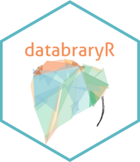

<!-- README.md is generated from README.Rmd. Please edit that file -->

# databraryr <a href="https://databrary.github.io/databraryr/"></a>

<!-- badges: start -->

[](https://CRAN.R-project.org/package=databraryr)
[](https://lifecycle.r-lib.org/articles/stages.html#stable)
[](https://github.com/databrary/databraryr/actions/workflows/R-CMD-check.yaml)
<!-- badges: end -->

## Overview

databraryr is a wrapper for the [Databrary](https://databrary.org) data
library’s application programming interface (API). The package can be
used to create reproducible data wrangling, analysis, and visualization
pipelines from data stored and shared on Databrary.

## Installation

``` r
# The easiest way to install databraryr is from CRAN
install.packages("databraryr")

# The development release can be installed from GitHub
install.packages("pak")
pak::pak("databrary/databraryr")
```

## Usage

Databrary ([databrary.org](https://databrary.org)) is a
restricted-access research data library specialized for storing and
sharing video with capabilities of storing [other
types](https://nyu.databrary.org/asset/formats/) of associated data.
Access to restricted data requires registration and formal approval by
an institution. The registration process involves the creation of an
(email-account-based) user account and secure password. Once
institutional authorization has been granted, a user may gain access to
shared video, audio, and other data. See
<https://databrary.org/about.html> for more information about gaining
access to restricted data.

However, many commands in the `databraryr` package return meaningful
results *without* or *prior to* formal authorization. These commands
access public data or metadata.

``` r
library(databraryr)
#> Welcome to the databraryr package.

get_db_stats()
#> # A tibble: 1 × 1
#>   date               
#>   <dttm>             
#> 1 2025-10-31 12:05:57

list_volume_assets() |> 
  head()
#> # A tibble: 6 × 17
#>   asset_id asset_name                asset_permission asset_size
#>      <int> <chr>                     <chr>                 <dbl>
#> 1     9826 Introduction              public             88610655
#> 2     9828 Databrary demo            public            917124852
#> 3     9830 Databrary 1               public            899912341
#> 4     9832 Datavyu                   public            764340542
#> 5    22412 Slides                    public              4573426
#> 6     9834 Overview and Policy Upda… public           1301079971
#> # ℹ 12 more variables: asset_mime_type <chr>, asset_format_id <int>,
#> #   asset_format_name <chr>, asset_created_at <chr>, asset_updated_at <chr>,
#> #   asset_sha1 <chr>, session_id <int>, session_name <chr>,
#> #   session_date <chr>, session_release <chr>, asset_uploader_id <int>,
#> #   asset_uploader_first_name <chr>, asset_uploader_last_name <chr>
```

## Testing

The test suite includes integration tests that run against the Databrary API. These tests require the following environment variables to
be set:

| Variable | Description |
|---|---|
| `DATABRARY_LOGIN` | Email address for the account |
| `DATABRARY_PASSWORD` | Password for the account |
| `DATABRARY_CLIENT_ID` | OAuth client ID |
| `DATABRARY_CLIENT_SECRET` | OAuth client secret |
| `DATABRARY_BASE_URL` | *(optional)* API base URL; defaults to `https://api.stg-databrary.its.nyu.edu` |

Tests that require authentication are automatically skipped when these
variables are not available.

The recommended way to provide them is a project-level `.Renviron` file
in the package root:

``` bash
DATABRARY_LOGIN=you@example.com
DATABRARY_PASSWORD=your-password
DATABRARY_CLIENT_ID=your-client-id
DATABRARY_CLIENT_SECRET=your-client-secret
```

R loads this file automatically on startup, so `devtools::test()` and
`devtools::check()` will pick up the credentials without any extra
steps.

## Lifecycle

Rick Gilmore has been using experimental versions of databraryr for many
years, but the package was only released to CRAN in the fall of 2023.
Some new features are on the roadmap, but the package is largely stable.
